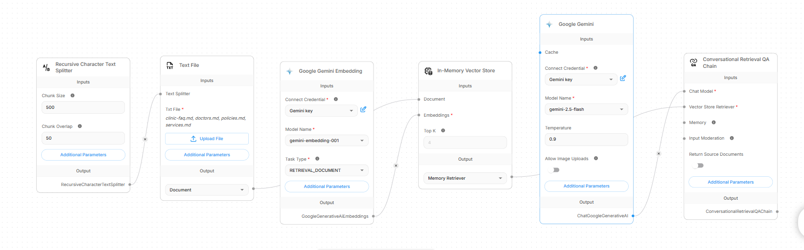
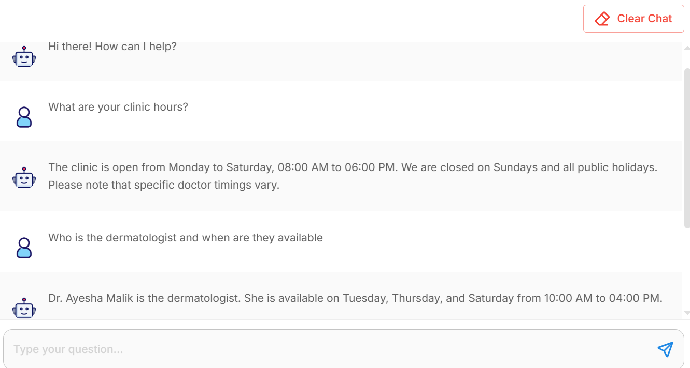
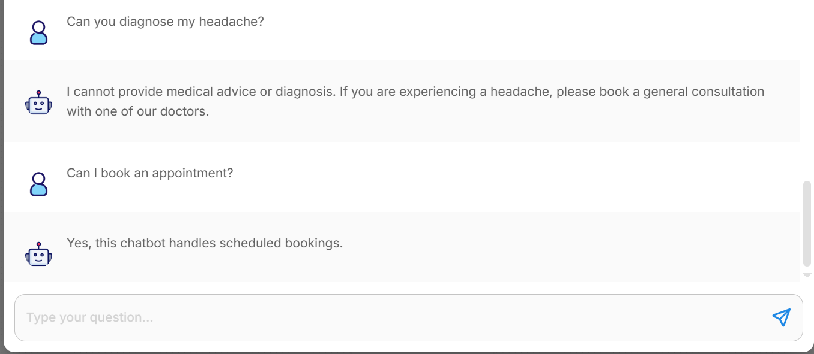

# Week 2 Deliverables: Knowledge Base & RAG Chatflow

This folder contains all the completed deliverables for Week 2 of the Clinic Appointment Agent project.

## 1. RAG Knowledge Base (`/knowledge-base/`)
The AI chatbot relies on these structured documents to retrieve accurate information about the clinic. The data is kept entirely fictional and follows the privacy guidelines.

- **`clinic-faq.md`**: General clinic information, timings, and location.
- **`doctors.md`**: Directory of demo doctors and their schedules.
- **`services.md`**: Available medical services, durations, and estimated costs.
- **`policies.md`**: Clinic rules on booking, late arrivals, cancellations, and rescheduling.

## 2. Chatbot Configuration (`Clinic_Agent_Chatflow.json`)
This JSON file is the exported Chatflow containing the visual nodes, connections, and RAG configuration (Document Loaders, Text Splitters, Vector Store, and LLM). 

**To test the bot:**
1. Import `Clinic_Agent_Chatflow.json` into Flowise/Langflow (or Dify/Coze).
2. Upload the 4 knowledge base files into the document loader node.
3. Chat with the bot to verify it accurately retrieves timings, prices, and policies!

## 3. RAG Testing Screenshots
Below are the screenshots demonstrating the AI agent correctly reading the knowledge base and answering patient queries:

