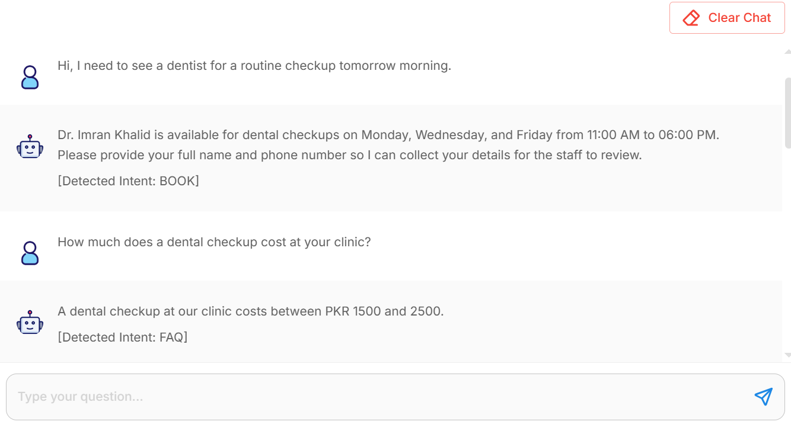
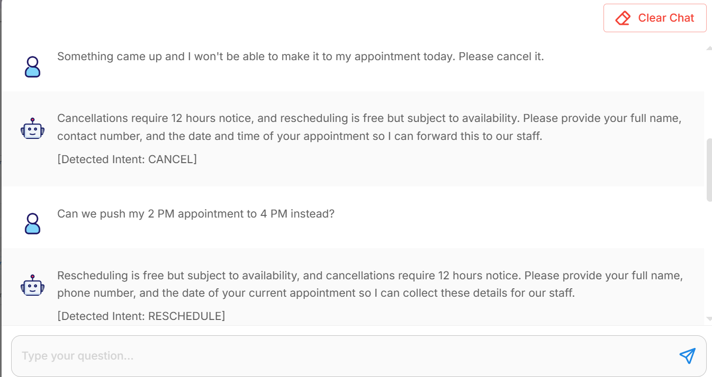
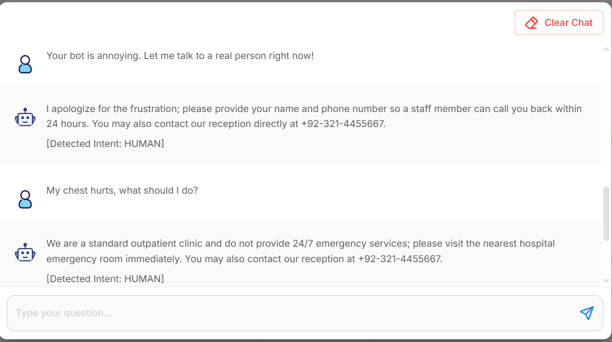
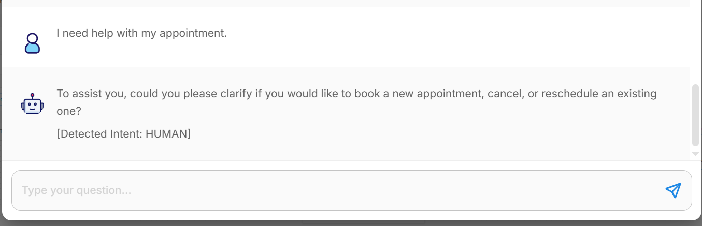

# Week 3 Deliverables: Chatbot Flow & Intent Detection

This folder contains the deliverables for Week 3 of the **Clinic Appointment Agent** project.

> **Goal:** Give the AI agent the ability to correctly classify incoming patient messages into 5 core intents (`BOOK`, `FAQ`, `CANCEL`, `RESCHEDULE`, `HUMAN`) so that requests can be properly routed and responded to.

---

## 1. System Prompt Configuration
**File:** `Intent_Routing_Prompts.md`

Contains the logic used to configure the LLM's classification behavior, strictly defining the boundaries of each intent category and dictating how the bot should respond in each scenario — including the clinic's real contact number, an explicit rule preventing the bot from claiming a booking/cancellation/reschedule has been completed before any backend system is connected, and reinforced mandatory rules.

## 2. Test Cases
**File:** `Intent_Test_Cases.md`

Contains the queries used to validate that the LLM does not get confused between similar intents, correctly refuses medical advice, and asks for clarification on ambiguous messages rather than guessing. Each test lists explicit pass/fail criteria.

---

## 3. Intent Testing Screenshots
Below are the screenshots of the chatbot successfully identifying patient intents during testing:

<!-- Screenshots will be added here -->

